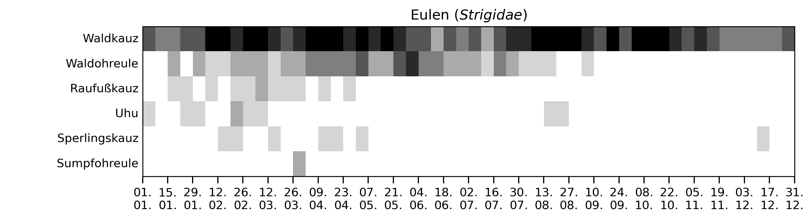
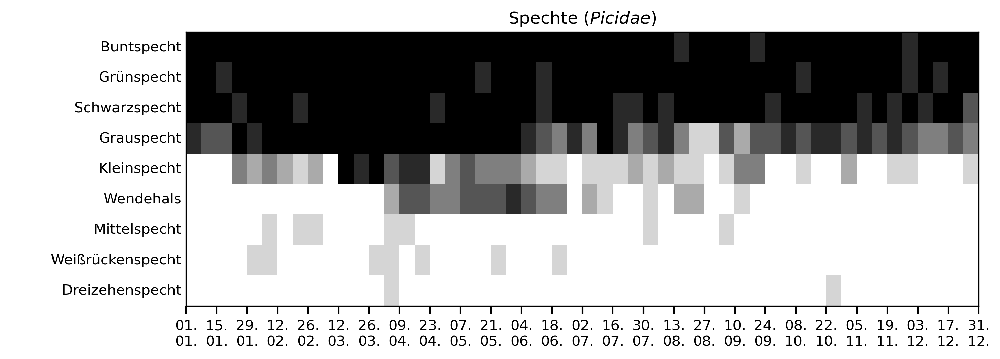
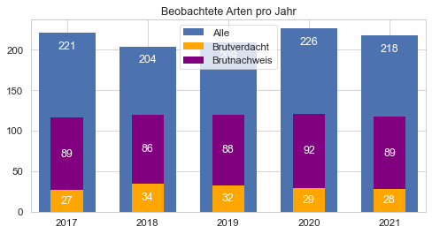

# Auswertungen von ornithologischen Beobachtungsdaten

des Internetportals ornitho.de im Landkreis Starnberg.

## Es geht wieder los!
Eulen und Spechte gehören zu den ersten Arten, auf die man sich im neuen Jahr wieder freuen kann. Ihr Auftreten - auch innerhalb der jeweiligen Familie - kann aber doch recht unterschiedlich sein, wie nachfolgende Darstellungen zeigen.

Gezeigt werden alle im Zeitraum 2016-2021 gemeldeten Arten. Je schwärzer, desto höher die Auftretenwahrscheinlichkeit in der entsprechenden Woche.

## Brutvögel in STA

Aktualisierte (Stand 31.12.2021) [Liste der Brutvögel in STA](res/Max_BZC_pro_Taxon_und_Jahr.xlsx) basierend auf Beobachtungen und Brutzeitcodes auf ornitho.de.

