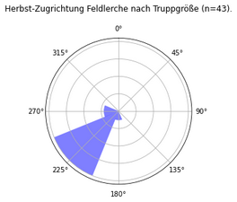

# Auswertungen von ornithologischen Beobachtungsdaten

des Internetportals ornitho.de im Landkreis Starnberg.

## Zugrichtungen
Bei der Dateineingabe auf ornitho.de kann man bei Zugbeobachtungen die ungefähre Zugrichtung eingeben. Aus vielen Meldungen kann man dann einen groben Zugvektor ableiten. 
Interessanterweise bekommt man hier schon für relativ wenige Beobachtungen gute Ergebnisse. Daher bitte immer die Zugrichtung mit angeben!

 
Zugbeobachtungen mit Richtungsangabe im ersten (links) bzw. zweiten (rechts) Halbjahr. Im Frühjahr scheint der Zugvektor strenger in Ost-Westrichtung zu verlaufen.

Feldlerche, Ringeltaube und Wiesenpieper kennen im Herbst dagegen nur eine Richtung:

  

## Familienverhältnisse, oder "es geht wieder los!"
Eulen und Spechte gehören zu den ersten Arten, auf die man sich im neuen Jahr wieder freuen kann. Ihr Auftreten - auch innerhalb der jeweiligen Familie - kann aber doch recht unterschiedlich sein, wie nachfolgende Darstellungen zeigen.

Gezeigt werden alle im Zeitraum 2016-2021 gemeldeten Arten. Je dunkler, desto höher die Auftretenswahrscheinlichkeit in der entsprechenden Woche.

## Brutvögel in STA

Aktualisierte (Stand 31.12.2021) [Liste der Brutvögel in STA](res/Max_BZC_pro_Taxon_und_Jahr.xlsx) basierend auf Beobachtungen und Brutzeitcodes auf ornitho.de.

